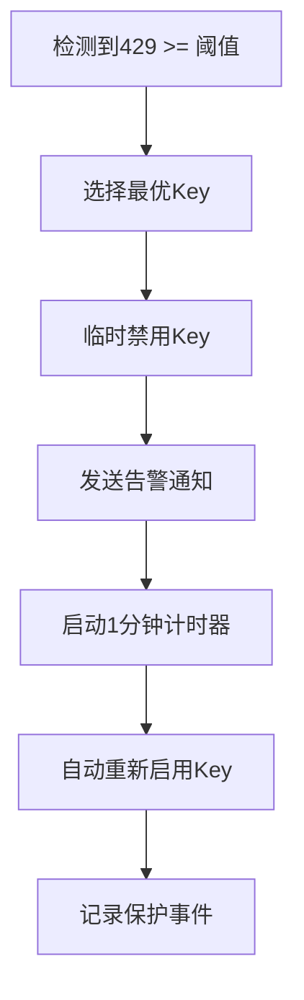

# Azure OpenAI 监控服务使用手册

## 📋 目录

1. [概述](#概述)
2. [功能特性](#功能特性)
3. [系统要求](#系统要求)
4. [安装部署](#安装部署)
5. [配置指南](#配置指南)
6. [使用说明](#使用说明)
7. [API接口](#api接口)
8. [监控和告警](#监控和告警)
9. [故障排除](#故障排除)
10. [最佳实践](#最佳实践)
11. [维护指南](#维护指南)

---

## 概述

Azure OpenAI 监控服务是一个企业级的自动化监控系统，专门用于保护Azure OpenAI服务的API调用安全。该服务能够：

- **实时监控**：每5秒检查API调用状态
- **自动保护**：检测到429错误时自动禁用API Key
- **智能恢复**：1分钟后自动重新启用Key
- **多级告警**：邮件、Webhook等多渠道通知
- **安全防护**：防止Azure订阅被暂停（blended）

### 核心价值

🛡️ **账号安全保护** - 自动响应429错误，保护Azure订阅
⚡ **实时监控** - 5秒间隔监控，及时发现问题
🔄 **自动恢复** - 无需人工干预，自动恢复服务
📊 **详细统计** - 完整的监控数据和保护历史
🚨 **多级告警** - 确保相关人员及时收到通知

---

## 功能特性

### 监控功能
- ✅ **实时监控**：每5秒检查一次Azure OpenAI服务的429错误
- ✅ **多服务支持**：可同时监控多个OpenAI服务实例
- ✅ **跨订阅监控**：支持跨资源组、跨订阅的监控
- ✅ **智能检测**：基于Azure Monitor Metrics API的精确检测

### 保护功能
- 🛡️ **自动禁用**：429错误超过阈值时自动禁用API Key
- 🔄 **智能恢复**：1分钟后自动重新启用Key
- 🎯 **智能选择**：选择最优Key进行保护（基于禁用历史）
- ⏰ **冷却机制**：2分钟冷却期防止频繁禁用

### 告警功能
- 📧 **邮件告警**：详细的保护状态分析和建议
- 🔗 **Webhook告警**：结构化事件通知给监控系统
- 🚨 **紧急告警**：多服务同时触发保护时的紧急通知
- 📊 **状态报告**：完整的保护状态和历史记录

### 管理功能
- 📈 **统计信息**：详细的监控和保护统计数据
- 🏥 **健康检查**：系统连接和服务状态检查
- 📝 **操作日志**：完整的Key管理和保护事件记录
- 🎛️ **配置管理**：灵活的参数配置和管理

---

## 系统要求

### 本地环境要求

#### 必需软件
1. **Azure CLI** (版本2.30.0+)
   ```bash
   # Windows (PowerShell)
   Invoke-WebRequest -Uri https://aka.ms/installazurecliwindows -OutFile .\AzureCLI.msi
   Start-Process msiexec.exe -Wait -ArgumentList '/I AzureCLI.msi /quiet'

   # 验证安装
   az --version
   ```

2. **Azure Functions Core Tools** (版本4.0+)
   ```bash
   # 使用npm安装
   npm install -g azure-functions-core-tools@4 --unsafe-perm true

   # 验证安装
   func --version
   ```

3. **Git** (用于代码管理)
   ```bash
   # Windows
   git --version
   ```

#### 可选软件
- **jq** (用于JSON处理，部署脚本使用)
  ```bash
  # Windows (使用Chocolatey)
  choco install jq
  ```

### Azure环境要求

#### 订阅要求
- Azure订阅具有创建资源的权限
- 支持创建以下资源：
  - Azure Functions Consumption Plan
  - Azure Storage Account
  - Azure AD应用程序
  - Cognitive Services资源访问权限

#### 权限要求
需要以下Azure角色权限：
- `Contributor` - 在目标资源组创建资源
- `User Access Administrator` - 创建Azure AD应用程序
- `Monitoring Reader` - 读取监控数据
- `Cognitive Services Contributor` - 管理API Key

---

## 安装部署

### 方式一：一键自动化部署（推荐）

这是最简单、最安全的部署方式，会自动完成所有配置。

#### 步骤1：准备环境
```bash
# 克隆或下载项目
cd D:\www\burncloud-api-azure-limit

# 检查依赖
bash deployment/deploy.sh --check-dependencies
```

#### 步骤2：登录Azure
```bash
# 登录到Azure
az login

# 设置订阅（如果有多个订阅）
az account set --subscription "your-subscription-id"
```

#### 步骤3：执行自动化部署
```bash
# 执行一键部署脚本
bash deployment/deploy.sh
```

部署脚本会自动：
1. 创建Azure AD应用程序
2. 分配必要的权限
3. 部署Azure Functions基础设施
4. 配置应用设置
5. 部署监控代码
6. 验证部署结果

#### 步骤4：配置参数
部署过程中需要提供以下信息：

```bash
# 必需参数
请输入Azure订阅ID: xxxxxxxx-xxxx-xxxx-xxxx-xxxxxxxxxxxx
请输入资源组名称: openai-monitor-rg
请输入要监控的OpenAI服务名称: my-openai-service

# 可选参数
请输入429错误阈值 (默认10): 15
请输入检查间隔秒数 (默认5): 10
请输入Key禁用时长分钟数 (默认1): 2

# 告警配置
是否启用邮件告警？(Y/n): Y
请输入邮件接收者: admin@company.com,ops@company.com
```

#### 步骤5：验证部署
```bash
# 使用测试脚本验证部署
bash scripts/test-deployment.sh <resource-group> <function-app-name>

# 或手动验证
curl https://<app-name>.azurewebsites.net/api/health
curl https://<app-name>.azurewebsites.net/api/protection
```

### 方式二：手动分步部署

如果需要更精细的控制，可以手动部署。

#### 步骤1：创建Azure AD应用
```bash
# 使用辅助脚本创建
bash scripts/setup-azure-ad.sh create "openai-monitor-app"

# 手动创建
APP_NAME="openai-monitor-$(whoami)-$(date +%s)"
az ad app create --display-name "$APP_NAME" --sign-in-audience AzureADMyOrg
az ad sp create --id <app-id>
az ad app credential reset --id <app-id>
```

#### 步骤2：分配权限
```bash
SUBSCRIPTION_ID="your-subscription-id"
APP_ID="your-app-id"

# 分配监控权限
az role assignment create \
  --assignee $APP_ID \
  --role "Monitoring Reader" \
  --scope /subscriptions/$SUBSCRIPTION_ID

# 分配认知服务权限
az role assignment create \
  --assignee $APP_ID \
  --role "Cognitive Services Contributor" \
  --scope /subscriptions/$SUBSCRIPTION_ID
```

#### 步骤3：部署基础设施
```bash
RESOURCE_GROUP="openai-monitor-rg"
LOCATION="eastus"
APP_NAME="openai-monitor-$(whoami)"

# 创建资源组
az group create --name $RESOURCE_GROUP --location $LOCATION

# 部署ARM模板
az deployment group create \
  --resource-group $RESOURCE_GROUP \
  --template-file deployment/arm-template.json \
  --parameters @deployment/parameters.json \
  --parameters functionAppName=$APP_NAME
```

#### 步骤4：配置应用设置
```bash
# 基础配置
az functionapp config appsettings set \
  --resource-group $RESOURCE_GROUP \
  --name $APP_NAME \
  --settings \
  "AZURE_TENANT_ID=your-tenant-id" \
  "AZURE_CLIENT_ID=your-client-id" \
  "AZURE_CLIENT_SECRET=your-client-secret" \
  "AZURE_SUBSCRIPTION_ID=your-subscription-id" \
  "MONITOR_429_THRESHOLD=10" \
  "MONITOR_CHECK_INTERVAL=5" \
  "MONITOR_KEY_DISABLE_DURATION=1"

# 服务配置
MONITOR_SERVICES_JSON='[
  {
    "name": "your-openai-service",
    "resource_group": "your-resource-group",
    "subscription_id": "your-subscription-id"
  }
]'

az functionapp config appsettings set \
  --resource-group $RESOURCE_GROUP \
  --name $APP_NAME \
  --settings "MONITOR_SERVICES_JSON=$MONITOR_SERVICES_JSON"
```

#### 步骤5：部署代码
```bash
# 进入源码目录
cd src

# 发布到Azure Functions
func azure functionapp publish $APP_NAME --python
```

---

## 配置指南

### 环境变量配置

#### 认证配置
```bash
AZURE_TENANT_ID=xxxxxxxx-xxxx-xxxx-xxxx-xxxxxxxxxxxx
AZURE_CLIENT_ID=yyyyyyyy-yyyy-yyyy-yyyy-yyyyyyyyyyyy
AZURE_CLIENT_SECRET=your-client-secret
AZURE_SUBSCRIPTION_ID=xxxxxxxx-xxxx-xxxx-xxxx-xxxxxxxxxxxx
```

#### 监控配置
```bash
MONITOR_CHECK_INTERVAL=5              # 检查间隔（秒）
MONITOR_429_THRESHOLD=10              # 429错误阈值
MONITOR_KEY_DISABLE_DURATION=1        # Key禁用时长（分钟）
```

#### 服务配置
```bash
# 单服务配置
SERVICE_NAME=your-openai-service
SERVICE_RESOURCE_GROUP=your-resource-group
SERVICE_SUBSCRIPTION_ID=your-subscription-id

# 多服务配置（JSON格式）
MONITOR_SERVICES_JSON='[
  {
    "name": "openai-service-1",
    "resource_group": "rg-1",
    "subscription_id": "sub-1"
  },
  {
    "name": "openai-service-2",
    "resource_group": "rg-2",
    "subscription_id": "sub-2"
  }
]'
```

#### 告警配置
```bash
# 邮件告警
ALERT_EMAIL_ENABLED=true
ALERT_EMAIL_RECIPIENTS=admin@company.com,ops@company.com

# SMTP配置（可选）
SMTP_SERVER=smtp.gmail.com
SMTP_PORT=587
SMTP_USERNAME=your-email@gmail.com
SMTP_PASSWORD=your-app-password
FROM_EMAIL=your-email@gmail.com

# Webhook告警
ALERT_WEBHOOK_ENABLED=true
ALERT_WEBHOOK_URL=https://your-slack-workspace.slack.com/services/YOUR/WEBHOOK/URL
```

### 高级配置

#### 调试配置
```bash
# 启用连接测试
RUN_CONNECTION_TEST=true

# 启用详细日志
LOGGING_LEVEL=DEBUG
```

#### 性能配置
```bash
# 函数超时时间
FUNCTION_TIMEOUT=00:05:00

# 内存限制
FUNCTION_MEMORY=512
```

### 配置文件示例

创建 `local.settings.json`：
```json
{
  "IsEncrypted": false,
  "Values": {
    "AzureWebJobsStorage": "UseDevelopmentStorage=true",
    "FUNCTIONS_WORKER_RUNTIME": "python",
    "AZURE_TENANT_ID": "xxxxxxxx-xxxx-xxxx-xxxx-xxxxxxxxxxxx",
    "AZURE_CLIENT_ID": "yyyyyyyy-yyyy-yyyy-yyyy-yyyyyyyyyyyy",
    "AZURE_CLIENT_SECRET": "your-client-secret",
    "AZURE_SUBSCRIPTION_ID": "xxxxxxxx-xxxx-xxxx-xxxx-xxxxxxxxxxxx",
    "MONITOR_SERVICES_JSON": "[{\"name\":\"your-openai-service\",\"resource_group\":\"your-rg\"}]",
    "MONITOR_429_THRESHOLD": "10",
    "MONITOR_CHECK_INTERVAL": "5",
    "MONITOR_KEY_DISABLE_DURATION": "1",
    "ALERT_EMAIL_ENABLED": "true",
    "ALERT_EMAIL_RECIPIENTS": "admin@company.com",
    "RUN_CONNECTION_TEST": "true"
  }
}
```

---

## 使用说明

### 本地开发和测试

#### 启动本地开发环境
```bash
# 安装依赖
pip install -r src/requirements.txt

# 配置本地环境变量
cp src/local.settings.json.example src/local.settings.json
# 编辑 local.settings.json

# 启动本地Functions
cd src
func start

# 在另一个终端测试
curl http://localhost:7071/api/health
curl http://localhost:7071/api/protection
```

#### 本地测试命令
```bash
# 测试健康检查
curl http://localhost:7071/api/health

# 获取统计信息
curl http://localhost:7071/api/stats

# 获取保护状态
curl http://localhost:7071/api/protection

# 测试告警配置（通过修改代码触发）
```

### 生产环境使用

#### 基础监控
部署完成后，服务会自动开始监控，无需额外操作。

#### 手动检查状态
```bash
# 获取Function App URL
FUNCTION_URL=$(az functionapp function list \
  --resource-group <rg-name> \
  --name <app-name> \
  --query "[0].invokeUrlTemplate" -o tsv)

# 检查健康状态
curl "${FUNCTION_URL/azure_openai_monitor/health}"

# 查看保护状态
curl "${FUNCTION_URL/azure_openai_monitor/protection}"

# 获取统计信息
curl "${FUNCTION_URL/azure_openai_monitor/stats}"
```

#### 查看日志
```bash
# 实时日志流
az webapp log tail --resource-group <rg-name> --name <app-name>

# Application Insights（如果配置）
az monitor app-insights query \
  --app <app-insights-name> \
  --analytics-query "requests | where timestamp > ago(1h)"
```

### 日常运维

#### 定期检查
```bash
# 每日健康检查脚本
#!/bin/bash
APP_NAME="your-app-name"
RG_NAME="your-rg"

# 检查服务状态
HEALTH_CHECK=$(curl -s "https://$APP_NAME.azurewebsites.net/api/health" | jq -r '.status')
if [ "$HEALTH_CHECK" != "healthy" ]; then
    echo "❌ Service health check failed: $HEALTH_CHECK"
    # 发送告警
fi

# 检查保护状态
PROTECTION_STATUS=$(curl -s "https://$APP_NAME.azurewebsites.net/api/protection" | jq -r '.protection_system_status')
echo "Protection status: $PROTECTION_STATUS"
```

#### 重启服务
```bash
# 重启Function App
az functionapp restart --resource-group <rg-name> --name <app-name>

# 重新部署代码
cd src
func azure functionapp publish <app-name> --python
```

---

## API接口

### 健康检查接口

#### 请求
```bash
GET /api/health
```

#### 响应示例
```json
{
  "status": "healthy",
  "timestamp": "2024-01-01T12:00:00Z",
  "connection_test": true,
  "configured_services": 2
}
```

#### 状态码
- `200`: 服务正常
- `503`: 服务异常（连接失败等）

### 统计信息接口

#### 请求
```bash
GET /api/stats
```

#### 响应示例
```json
{
  "total_checks": 1250,
  "total_429_detected": 15,
  "total_keys_disabled": 3,
  "total_keys_reenabled": 3,
  "configured_services": 2,
  "monitoring_interval": 5,
  "threshold_429": 10,
  "key_management": {
    "total_monitored_keys": 4,
    "currently_disabled_keys": 0,
    "recently_disabled_keys": 1,
    "protection_status": "active"
  },
  "protection_analysis": {
    "total_protection_events": 15,
    "recent_protection_events": 2,
    "last_protection_event": {
      "service_name": "openai-service-1",
      "error_count": 12,
      "action": "key_disabled",
      "timestamp": "2024-01-01T11:45:00Z",
      "reason": "429_rate_limit_exceeded"
    },
    "protection_efficiency": "active"
  }
}
```

### 保护状态接口

#### 请求
```bash
GET /api/protection
```

#### 响应示例
```json
{
  "protection_system_status": "ACTIVE",
  "report_timestamp": "2024-01-01T12:00:00Z",
  "monitoring_configuration": {
    "check_interval_seconds": 5,
    "threshold_429_per_minute": 10,
    "key_disable_duration_minutes": 1
  },
  "key_management_status": {
    "total_monitored_keys": 4,
    "currently_disabled_keys": 0,
    "recently_disabled_keys": 1,
    "key_disable_cooldown_minutes": 2,
    "protection_status": "active"
  },
  "protection_history": {
    "total_protection_events": 15,
    "recent_events": [
      {
        "service_name": "openai-service-1",
        "error_count": 12,
        "action": "key_disabled",
        "timestamp": "2024-01-01T11:45:00Z",
        "reason": "429_rate_limit_exceeded"
      }
    ],
    "most_recent_event": {
      "service_name": "openai-service-1",
      "error_count": 12,
      "action": "key_disabled",
      "timestamp": "2024-01-01T11:45:00Z",
      "reason": "429_rate_limit_exceeded"
    }
  },
  "account_safety_metrics": {
    "total_keys_disabled_today": 3,
    "total_429_errors_detected": 15,
    "protection_success_rate": "100%",
    "azure_subscription_risk_level": "PROTECTED"
  }
}
```

### 错误响应格式

所有接口在出错时返回统一格式：

```json
{
  "error": "详细错误信息",
  "timestamp": "2024-01-01T12:00:00Z",
  "service_type": "azure_openai_protection_monitor"
}
```

---

## 监控和告警

### 监控机制

#### 数据收集
- **来源**: Azure Monitor Metrics API
- **指标**: `TotalRequests` 过滤 `ResultCode eq '429'`
- **频率**: 每5秒查询一次
- **窗口**: 最近1分钟的统计数据

#### 阈值检测
- **默认阈值**: 1分钟内10次429错误
- **触发条件**: 错误数量 >= 阈值
- **响应时间**: 检测到后立即响应

#### 保护动作


### 告警系统

#### 邮件告警
**触发条件**:
- 单个服务触发429保护
- 多个服务同时触发保护（紧急告警）
- 系统错误或连接失败

**邮件内容**:
```markdown
🚨 API Key 自动禁用告警 🚨

服务信息:
- 服务名称: openai-service-1
- 资源组: rg-production
- 订阅ID: xxxxxxxx-xxxx-xxxx-xxxx-xxxxxxxxxxxx

Key信息:
- Key名称: key1
- 禁用时间: 2024-01-01 12:00:00
- 预计重新启用: 2024-01-01 12:01:00
- 累计禁用次数: 3

禁用原因: 429 rate limit exceeded: 12 errors in 1 minute

⚠️ 重要提醒:
1. 这是保护Azure账号安全的自动响应机制
2. 1分钟后Key将自动重新启用
3. 请检查API调用频率和实现适当的限流机制
```

#### Webhook告警
**数据格式**:
```json
{
  "event": "key_auto_disabled",
  "severity": "critical",
  "service_name": "openai-service-1",
  "resource_group": "rg-production",
  "key_name": "key1",
  "disable_reason": "429_rate_limit_exceeded",
  "disabled_at": "2024-01-01T12:00:00Z",
  "will_reenable_at": "2024-01-01T12:01:00Z",
  "disable_count": 3,
  "protection_action": "Account protection - Preventing Azure subscription suspension"
}
```

#### 告警配置示例

**Slack集成**:
```bash
ALERT_WEBHOOK_ENABLED=true
ALERT_WEBHOOK_URL=https://your-slack-workspace.slack.com/services/YOUR/WEBHOOK/URL
```

**Microsoft Teams集成**:
```bash
ALERT_WEBHOOK_ENABLED=true
ALERT_WEBHOOK_URL=https://outlook.office.com/webhook/YOUR-TEAMS-WEBHOOK-URL
```

**自定义Webhook**:
```bash
ALERT_WEBHOOK_ENABLED=true
ALERT_WEBHOOK_URL=https://your-api.com/webhooks/azure-alerts
```

### 监控仪表板

#### Azure Dashboard配置
1. 创建Azure Dashboard
2. 添加以下指标：
   - Function App执行次数
   - Function App错误率
   - Azure Monitor 429错误计数
   - Application Insights请求统计

#### 自定义告警规则
```bash
# 创建429错误率告警
az monitor metrics alert create \
  --name "High-429-Rate" \
  --resource-group <rg-name> \
  --scopes <openai-service-id> \
  --condition "avg TotalRequests > 10" \
  --window-size 1m \
  --evaluation-frequency 1m \
  --action-group <action-group-name>
```

---

## 故障排除

### 常见问题及解决方案

#### 1. 部署失败

**问题**: 脚本执行失败
```
Error: Deployment failed: Invalid template
```

**解决方案**:
```bash
# 检查Azure CLI版本
az --version

# 更新Azure CLI
az upgrade

# 检查权限
az account show
az role assignment list --assignee <your-user-id>
```

#### 2. 认证失败

**问题**: 无法连接到Azure服务
```
Error: Failed to get access token: 401 Unauthorized
```

**解决方案**:
```bash
# 检查Azure AD应用状态
APP_ID="your-app-id"
az ad app show --id $APP_ID

# 重新生成客户端密钥
az ad app credential reset --id $APP_ID

# 检查权限分配
az role assignment list --assignee $APP_ID
```

#### 3. Metrics API访问失败

**问题**: 无法获取429错误数据
```
Error: Metrics API error: 403 Forbidden
```

**解决方案**:
```bash
# 检查Monitoring Reader权限
az role assignment list \
  --assignee <app-id> \
  --role "Monitoring Reader"

# 重新分配权限
az role assignment create \
  --assignee <app-id> \
  --role "Monitoring Reader" \
  --scope /subscriptions/<subscription-id>
```

#### 4. Function App无法启动

**问题**: 函数应用启动失败
```
Error: The function app is in a failed state
```

**解决方案**:
```bash
# 检查应用设置
az functionapp config appsettings list \
  --resource-group <rg-name> \
  --name <app-name>

# 重启应用
az functionapp restart \
  --resource-group <rg-name> \
  --name <app-name>

# 查看详细错误
az webapp log tail \
  --resource-group <rg-name> \
  --name <app-name>
```

#### 5. Key管理失败

**问题**: 无法禁用或重新启用Key
```
Error: Failed to disable key: 400 Bad Request
```

**解决方案**:
```bash
# 检查Cognitive Services权限
az role assignment list \
  --assignee <app-id> \
  --role "Cognitive Services Contributor"

# 检查服务状态
az cognitiveservices account show \
  --name <service-name> \
  --resource-group <rg-name>

# 手动测试API Key操作
az cognitiveservices account keys list \
  --name <service-name> \
  --resource-group <rg-name>
```

#### 6. 告警不工作

**问题**: 邮件或Webhook告警未发送

**解决方案**:
```bash
# 检查SMTP配置
telnet smtp.gmail.com 587

# 测试Webhook连接
curl -X POST https://your-webhook-url \
  -H "Content-Type: application/json" \
  -d '{"test": true}'

# 检查应用设置
az functionapp config appsettings show \
  --resource-group <rg-name> \
  --name <app-name> \
  --query "[?name=='ALERT_EMAIL_ENABLED']"
```

### 调试技巧

#### 启用详细日志
```bash
# 设置调试级别
az functionapp config appsettings set \
  --resource-group <rg-name> \
  --name <app-name> \
  --settings "LOGGING_LEVEL=DEBUG"

# 查看实时日志
az webapp log tail \
  --resource-group <rg-name> \
  --name <app-name>
```

#### 本地调试
```bash
# 本地运行
cd src
func start

# 设置本地环境变量
export LOGGING_LEVEL=DEBUG
export RUN_CONNECTION_TEST=true

# 测试API
curl http://localhost:7071/api/health
```

#### 性能分析
```bash
# 检查函数执行时间
az monitor app-insights query \
  --app <app-insights-name> \
  --analytics-query "requests | where timestamp > ago(1h) | summarize avg(duration) by name"

# 检查错误率
az monitor app-insights query \
  --app <app-insights-name> \
  --analytics-query "requests | where success == false | summarize count() by name"
```

---

## 最佳实践

### 部署最佳实践

#### 1. 环境分离
```bash
# 为不同环境使用不同的资源组
RG_DEV="openai-monitor-dev"
RG_PROD="openai-monitor-prod"

# 为不同环境使用不同的Function App
APP_DEV="openai-monitor-dev"
APP_PROD="openai-monitor-prod"
```

#### 2. 配置管理
```bash
# 使用环境特定的配置
# 开发环境
MONITOR_429_THRESHOLD=5
MONITOR_CHECK_INTERVAL=10

# 生产环境
MONITOR_429_THRESHOLD=15
MONITOR_CHECK_INTERVAL=5
```

#### 3. 安全配置
```bash
# 使用托管身份（推荐）
az functionapp identity assign \
  --resource-group <rg-name> \
  --name <app-name>

# 限制网络访问
az functionapp config access-restriction add \
  --resource-group <rg-name> \
  --name <app-name> \
  --rule-name "AllowCorporateNetwork" \
  --action Allow \
  --vnet-name <vnet-name> \
  --subnet <subnet-name>
```

### 监控最佳实践

#### 1. 阈值配置
根据业务特点调整阈值：

```bash
# 高频服务（生产环境）
MONITOR_429_THRESHOLD=20
MONITOR_KEY_DISABLE_DURATION=2

# 低频服务（开发环境）
MONITOR_429_THRESHOLD=5
MONITOR_KEY_DISABLE_DURATION=1

# 关键服务（业务核心）
MONITOR_429_THRESHOLD=10
MONITOR_KEY_DISABLE_DURATION=5
```

#### 2. 告警配置
```bash
# 分级告警
# 紧急：立即通知
ALERT_EMAIL_RECIPIENTS="oncall@company.com,manager@company.com"

# 一般：日常通知
ALERT_EMAIL_RECIPIENTS="dev-team@company.com"
```

#### 3. 监控覆盖
```bash
# 监控所有相关服务
MONITOR_SERVICES_JSON='[
  {"name": "prod-openai-gpt4", "resource_group": "rg-prod"},
  {"name": "prod-openai-embedding", "resource_group": "rg-prod"},
  {"name": "staging-openai", "resource_group": "rg-staging"}
]'
```

### 运维最佳实践

#### 1. 定期维护
```bash
# 每日检查脚本
#!/bin/bash
HEALTH_URL="https://$APP_NAME.azurewebsites.net/api/health"
STATUS=$(curl -s $HEALTH_URL | jq -r '.status')

if [ "$STATUS" != "healthy" ]; then
    echo "⚠️ Service health check failed: $STATUS"
    # 发送告警
fi
```

#### 2. 性能优化
```bash
# 根据负载调整Function App配置
az functionapp config appsettings set \
  --resource-group <rg-name> \
  --name <app-name> \
  --settings "FUNCTION_WORKER_PROCESS_COUNT=1"
```

#### 3. 备份和恢复
```bash
# 备份配置
az functionapp config appsettings list \
  --resource-group <rg-name> \
  --name <app-name> > backup/settings-$(date +%Y%m%d).json

# 备份函数代码
func azure functionapp list-publishing-profiles \
  --resource-group <rg-name> \
  --name <app-name>
```

### 安全最佳实践

#### 1. 凭据管理
```bash
# 使用Azure Key Vault存储密钥
az keyvault create \
  --name <keyvault-name> \
  --resource-group <rg-name> \
  --location <location>

# 存储客户端密钥
az keyvault secret set \
  --vault-name <keyvault-name> \
  --name "openai-monitor-client-secret" \
  --value "your-client-secret"
```

#### 2. 网络安全
```bash
# 启用HTTPS Only
az functionapp config https-only \
  --resource-group <rg-name> \
  --name <app-name> \
  --true

# 配置客户端证书
az functionapp config ssl bind \
  --resource-group <rg-name> \
  --name <app-name> \
  --certificate-thumbprint <thumbprint> \
  --ssl-type SNI
```

#### 3. 访问控制
```bash
# 使用最小权限原则
# 仅授予必要的权限
az role assignment create \
  --assignee <app-id> \
  --role "Monitoring Reader" \
  --scope /subscriptions/<subscription-id>/resourceGroups/<rg-name>
```

---

## 维护指南

### 日常维护任务

#### 每日任务
- [ ] 检查服务健康状态
- [ ] 查看告警日志
- [ ] 验证保护事件
- [ ] 监控性能指标

#### 每周任务
- [ ] 分析保护趋势
- [ ] 检查Key使用情况
- [ ] 验证告警配置
- [ ] 更新监控阈值

#### 每月任务
- [ ] 审查权限配置
- [ ] 轮换Azure AD应用密钥
- [ ] 分析成本使用
- [ ] 更新文档

#### 每季度任务
- [ ] 安全评估
- [ ] 性能优化
- [ ] 灾难恢复测试
- [ ] 架构审查

### 维护脚本

#### 健康检查脚本
```bash
#!/bin/bash
# health-check.sh

APP_NAME="your-app-name"
WEBHOOK_URL="your-webhook-url"

# 检查健康状态
HEALTH_CHECK=$(curl -s "https://$APP_NAME.azurewebsites.net/api/health")
STATUS=$(echo $HEALTH_CHECK | jq -r '.status')

if [ "$STATUS" != "healthy" ]; then
    echo "❌ Health check failed"

    # 发送告警
    curl -X POST $WEBHOOK_URL \
      -H "Content-Type: application/json" \
      -d "{
        \"text\": \"🚨 Azure OpenAI Monitor Health Check Failed\",
        \"attachments\": [{
          \"color\": \"danger\",
          \"fields\": [{
            \"title\": \"Status\",
            \"value\": \"$STATUS\",
            \"short\": true
          }, {
            \"title\": \"Time\",
            \"value\": \"$(date)\",
            \"short\": true
          }]
        }]
      }"
else
    echo "✅ Health check passed"
fi
```

#### 配置备份脚本
```bash
#!/bin/bash
# backup-config.sh

APP_NAME="your-app-name"
RG_NAME="your-rg"
BACKUP_DIR="backup/$(date +%Y%m%d)"

mkdir -p $BACKUP_DIR

# 备份应用设置
az functionapp config appsettings list \
  --resource-group $RG_NAME \
  --name $APP_NAME > $BACKUP_DIR/app-settings.json

# 备份函数配置
az functionapp show \
  --resource-group $RG_NAME \
  --name $APP_NAME > $BACKUP_DIR/function-app.json

echo "✅ Configuration backed up to $BACKUP_DIR"
```

#### 性能监控脚本
```bash
#!/bin/bash
# performance-monitor.sh

APP_INSIGHTS="your-app-insights"
QUERY='requests | where timestamp > ago(1h) | summarize count(), avg(duration) by name'

# 获取性能数据
az monitor app-insights query \
  --app $APP_INSIGHTS \
  --analytics-query "$QUERY" > performance-$(date +%Y%m%d-%H%M%S).json

echo "✅ Performance data collected"
```

### 故障恢复程序

#### 服务恢复
```bash
#!/bin/bash
# service-recovery.sh

APP_NAME="your-app-name"
RG_NAME="your-rg"

echo "🔄 Starting service recovery..."

# 1. 重启服务
echo "Restarting Function App..."
az functionapp restart --resource-group $RG_NAME --name $APP_NAME

# 2. 等待服务启动
echo "Waiting for service to start..."
sleep 30

# 3. 验证健康状态
echo "Verifying health status..."
HEALTH_CHECK=$(curl -s "https://$APP_NAME.azurewebsites.net/api/health")
STATUS=$(echo $HEALTH_CHECK | jq -r '.status')

if [ "$STATUS" = "healthy" ]; then
    echo "✅ Service recovery successful"
else
    echo "❌ Service recovery failed, manual intervention required"
    exit 1
fi
```

#### 配置恢复
```bash
#!/bin/bash
# config-recovery.sh

BACKUP_FILE=$1
APP_NAME=$2
RG_NAME=$3

if [ -z "$BACKUP_FILE" ] || [ -z "$APP_NAME" ] || [ -z "$RG_NAME" ]; then
    echo "Usage: $0 <backup-file> <app-name> <resource-group>"
    exit 1
fi

echo "🔄 Restoring configuration from $BACKUP_FILE..."

# 恢复应用设置
while IFS= read -r setting; do
    NAME=$(echo $setting | jq -r '.name')
    VALUE=$(echo $setting | jq -r '.value')

    az functionapp config appsettings set \
      --resource-group $RG_NAME \
      --name $APP_NAME \
      --settings "$NAME=$VALUE"
done < <(jq -c '.[]' $BACKUP_FILE)

echo "✅ Configuration restored successfully"
```

### 升级程序

#### 代码升级
```bash
#!/bin/bash
# upgrade-service.sh

NEW_VERSION=$1
APP_NAME=$2
RG_NAME=$3

echo "🔄 Upgrading service to version $NEW_VERSION..."

# 1. 备份当前版本
./backup-config.sh

# 2. 部署新版本
cd src
func azure functionapp publish $APP_NAME --python

# 3. 验证部署
echo "Verifying deployment..."
sleep 60

HEALTH_CHECK=$(curl -s "https://$APP_NAME.azurewebsites.net/api/health")
STATUS=$(echo $HEALTH_CHECK | jq -r '.status')

if [ "$STATUS" = "healthy" ]; then
    echo "✅ Upgrade to version $NEW_VERSION successful"
else
    echo "❌ Upgrade failed, initiating rollback..."
    # 实现回滚逻辑
fi
```

---

## 联系支持

### 技术支持

如果遇到问题，请按以下步骤操作：

1. **检查文档**：查阅本手册的相关章节
2. **查看日志**：检查Azure Functions和Application Insights日志
3. **运行诊断**：使用内置的健康检查和保护状态API
4. **联系支持**：提供详细的错误信息和环境配置

### 支持信息

- **项目地址**：`D:\www\burncloud-api-azure-limit`
- **文档目录**：`docs/`
- **测试目录**：`tests/`
- **部署脚本**：`deployment/`

### 反馈和贡献

欢迎提供反馈和改进建议：
- 报告Bug：创建详细的问题报告
- 功能请求：描述所需功能和用例
- 文档改进：指出文档中的错误或不足

---

*本手册最后更新时间：2024年1月*